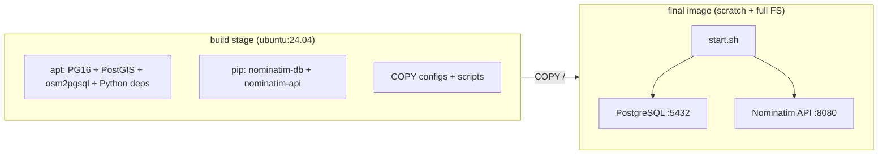

# Nominatim Docker Image — Step-by-Step Explanation

This document explains every step in [`research/Docerfile`](./Docerfile). It is a **multi-stage Docker image** for running [Nominatim](https://nominatim.org/) (OpenStreetMap geocoding) with PostgreSQL/PostGIS. It follows patterns from the [mediagis/nominatim-docker](https://github.com/mediagis/nominatim-docker) project.

---

## Build arguments (lines 1–2)

```dockerfile
ARG NOMINATIM_VERSION=5.3.2
ARG USER_AGENT=mediagis/nominatim-docker:${NOMINATIM_VERSION}
```

- **`NOMINATIM_VERSION`**: Pins the Python packages `nominatim-db` and `nominatim-api` to 5.3.2.
- **`USER_AGENT`**: HTTP User-Agent string Nominatim uses when talking to external services (e.g. OSM). Identifies this image build.

These can be overridden at build time: `docker build --build-arg NOMINATIM_VERSION=5.4.0`.

---

## Stage 1: `build` (lines 4–84)

### Base image and environment (lines 4–9)

```dockerfile
FROM ubuntu:24.04 AS build

ENV DEBIAN_FRONTEND=noninteractive
ENV LANG=C.UTF-8

WORKDIR /app
```

- **`ubuntu:24.04`**: Build stage base (Noble Numbat).
- **`DEBIAN_FRONTEND=noninteractive`**: Avoids apt prompts during install.
- **`LANG=C.UTF-8`**: UTF-8 locale for consistent text handling.
- **`WORKDIR /app`**: Default directory for later `COPY` and scripts.

### APT install with BuildKit cache (lines 11–45)

```dockerfile
RUN  \
    --mount=type=cache,target=/var/cache/apt,sharing=locked \
    --mount=type=cache,target=/var/lib/apt,sharing=locked \
    ...
```

**Cache mounts**: Reuse apt package lists and `.deb` files across builds (faster rebuilds).

**`keep-cache` apt config**: Stops Docker’s default `docker-clean` from deleting downloaded packages so the cache mount stays useful.

**`policy-rc.d` trick**: A script that always exits 101 so postinst scripts don’t start services (e.g. PostgreSQL) during `apt-get install` inside the build.

**Packages installed**:

| Package group | Purpose |
|---------------|---------|
| `locales` + `locale-gen en_US.UTF-8` | English UTF-8 locale for Postgres/Nominatim |
| `build-essential` | Compilers for anything built from source (removed later) |
| `osm2pgsql` | Imports OSM PBF into PostGIS |
| `pkg-config`, `libicu-dev`, `python3-dev`, `python3-pip`, `python3-icu` | Build/run Nominatim’s ICU tokenizer and Python stack |
| `postgresql-postgis`, `postgresql-postgis-scripts` | PostgreSQL 16 + PostGIS (Ubuntu’s default PG version on 24.04) |
| `curl`, `sudo`, `sshpass`, `openssh-client` | Downloads, admin, optional remote DB/SSH workflows |

`Install-Recommends/Suggests=false` keeps the image smaller.

### PostgreSQL network config (lines 48–51)

```dockerfile
RUN true \
    && echo "host all all 0.0.0.0/0 md5" >> /etc/postgresql/16/main/pg_hba.conf \
    && echo "listen_addresses='*'" >> /etc/postgresql/16/main/postgresql.conf
```

- **`pg_hba.conf`**: Allows TCP connections from any IP with password (`md5`).
- **`listen_addresses='*'`**: Postgres listens on all interfaces, not only localhost.

This is typical for a container where other containers or the host connect to port 5432. It is **not** ideal for an internet-facing host without a firewall.

### Nominatim Python stack (lines 56–64)

```dockerfile
RUN --mount=type=cache,target=/root/.cache/pip,sharing=locked pip install --break-system-packages \
    nominatim-db==$NOMINATIM_VERSION \
    osmium \
    psycopg[binary] \
    falcon \
    uvicorn \
    gunicorn \
    nominatim-api
```

- **`--break-system-packages`**: On Ubuntu 24.04, system Python is “externally managed”; this flag allows pip installs into that environment (common in Docker).
- **`nominatim-db`**: CLI and DB logic for import/indexing.
- **`osmium`**: Fast OSM PBF reading.
- **`psycopg[binary]`**: PostgreSQL driver for Python.
- **`falcon` + `uvicorn` + `gunicorn`**: HTTP API server stack for `nominatim-api`.
- **`nominatim-api`**: Search/reverse geocoding HTTP API.

Pip cache mount speeds rebuilds.

### Slim down build artifacts (lines 67–76)

```dockerfile
RUN true \
    && apt-get -y remove --purge --auto-remove \
        build-essential \
    && rm -rf \
        /tmp/* \
        /var/tmp/* \
    && pip cache purge
```

Removes compilers and temp files; drops pip wheel cache from the layer (pip cache was on a mount anyway).

### Postgres tuning and startup scripts (lines 78–84)

```dockerfile
COPY conf.d/postgres-import.conf /etc/postgresql/16/main/conf.d/postgres-import.conf.disabled
COPY conf.d/postgres-tuning.conf /etc/postgresql/16/main/conf.d/

COPY config.sh /app/config.sh
COPY init.sh /app/init.sh
COPY start.sh /app/start.sh
```

Expected **build context** files (normally sit beside this Dockerfile):

- **`postgres-import.conf.disabled`**: Aggressive import settings; disabled by default (`.disabled` suffix), likely enabled only during import via `init.sh`.
- **`postgres-tuning.conf`**: General runtime tuning (memory, checkpoints, etc.).
- **`config.sh`**: Env vars, paths, DB name, import options.
- **`init.sh`**: One-time setup: start Postgres, create DB, run `nominatim import`, etc.
- **`start.sh`**: Container entry behavior: start Postgres + API on each run.

---

## Stage 2: Single-layer runtime image (lines 86–107)

### Flatten filesystem with `scratch` (lines 86–89)

```dockerfile
# Collapse image to single layer.
FROM scratch

COPY --from=build / /
```

- **`FROM scratch`**: Empty image; no separate base layer.
- **`COPY --from=build / /`**: Copies the **entire** build root filesystem into one layer.

**Why**: Fewer layers, sometimes smaller/simpler image history; you lose incremental layer caching on the final image. Everything from stage 1 (Ubuntu, Postgres, Python, configs) lands in one tree.

### Runtime environment (lines 91–98)

```dockerfile
ENV NOMINATIM_PASSWORD=qaIACxO6wMR3
ENV WARMUP_ON_STARTUP=false

ENV PROJECT_DIR=/nominatim

ARG USER_AGENT
ENV USER_AGENT=${USER_AGENT}
```

- **`NOMINATIM_PASSWORD`**: Default Postgres/Nominatim password (comment says override this in production).
- **`WARMUP_ON_STARTUP`**: If `true`, likely preloads caches or runs warmup queries when the container starts.
- **`PROJECT_DIR`**: Data/project root (e.g. PBF, flatnode, settings).
- **`USER_AGENT`**: Passed through to runtime for outbound HTTP.

### Workdir, ports, env file, command (lines 100–107)

```dockerfile
WORKDIR /app

EXPOSE 5432
EXPOSE 8080

COPY conf.d/env $PROJECT_DIR/.env

CMD ["/app/start.sh"]
```

- **`WORKDIR /app`**: Where `start.sh` and friends live.
- **`5432`**: PostgreSQL.
- **`8080`**: Nominatim HTTP API (uvicorn/gunicorn).
- **`COPY conf.d/env` → `/nominatim/.env`**: Default environment file for the app (paths, flags); override at runtime with volumes or `-e`.
- **`CMD`**: Runs `start.sh` on container start (typical flow: start Postgres → maybe init if empty → start API).

---

## End-to-end flow (conceptual)



1. **Build**: Install OS packages, configure Postgres for remote access, install Nominatim via pip, add tuning/scripts.
2. **Flatten**: One filesystem snapshot as the runnable image.
3. **Run**: `start.sh` brings up DB and API; `init.sh` (usually once) imports a PBF from `PROJECT_DIR` or env.

---

## How this relates to the root `Dockerfile`

The repository root `Dockerfile` only extends the published image:

```dockerfile
FROM mediagis/nominatim:5.3

ENV PBF_PATH=/nominatim/data/pbf-data/virginia-260505.osm.pbf

EXPOSE 8080
```

`research/Docerfile` is the **recipe to build** something like `mediagis/nominatim:5.3` yourself, with version 5.3.2 and custom Postgres/scripts. The thin root Dockerfile assumes that image already exists and only sets which Virginia PBF to import.

---

## Gaps in the workspace

This Dockerfile expects a build context with:

- `conf.d/postgres-import.conf`
- `conf.d/postgres-tuning.conf`
- `conf.d/env`
- `config.sh`, `init.sh`, `start.sh`

Those files are not present in the minimal workspace snapshot. A `docker build` from `research/` alone would fail on those `COPY` lines until you restore them from [mediagis/nominatim-docker](https://github.com/mediagis/nominatim-docker) or write your own.
